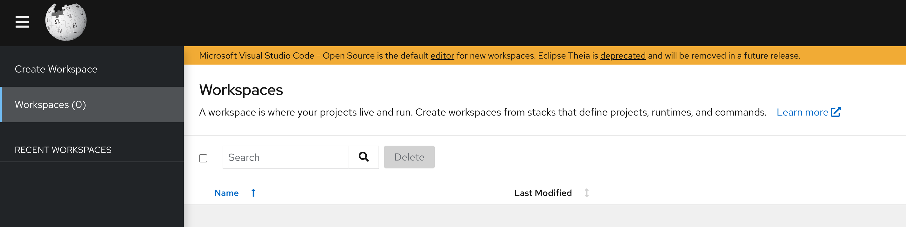

# Custom Che Dashbaord

This is a quick example repo of how to customize the Che Dashboard in OpenShift DevSpaces.

This repo takes the official DevSpaces Dashboard image and patches the branding resources for a custom UI.

